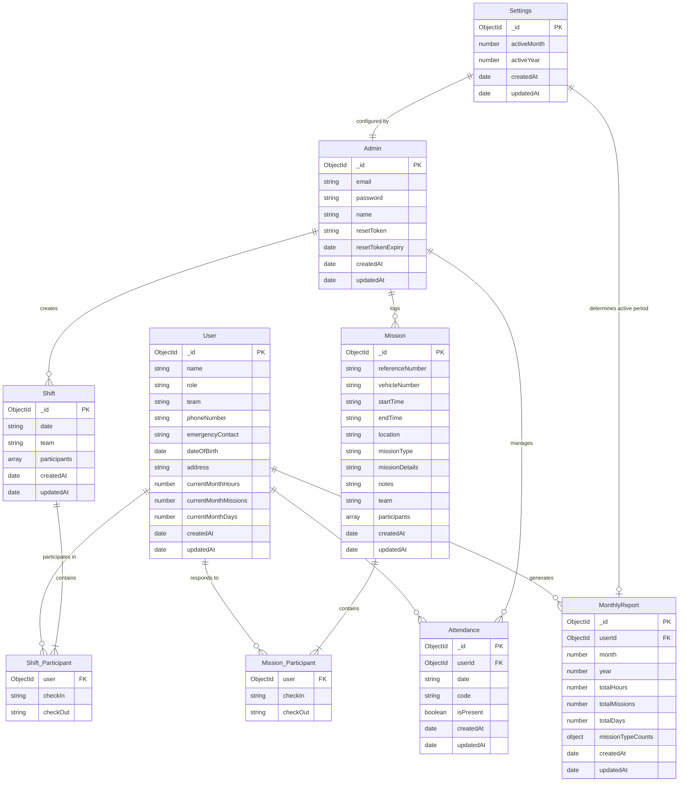
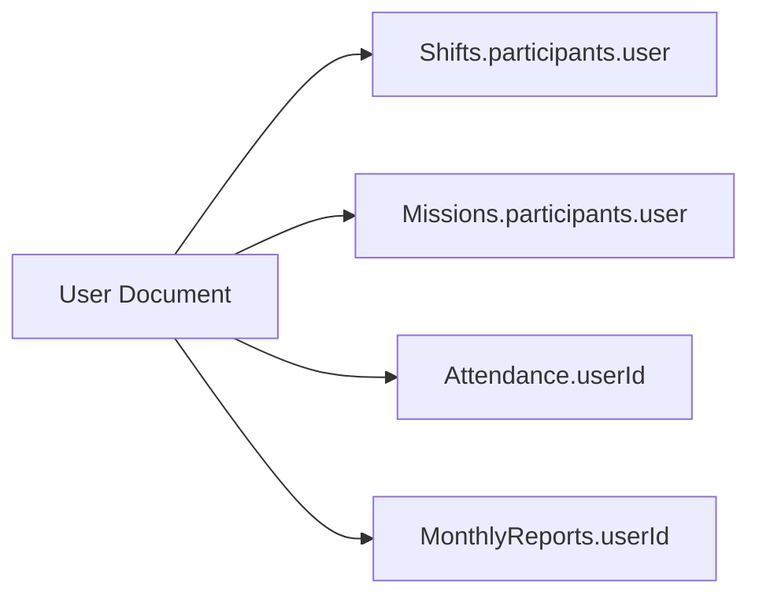
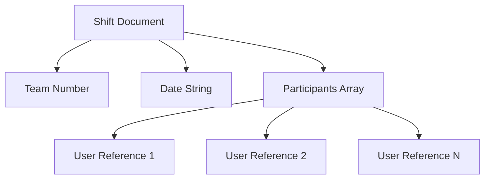
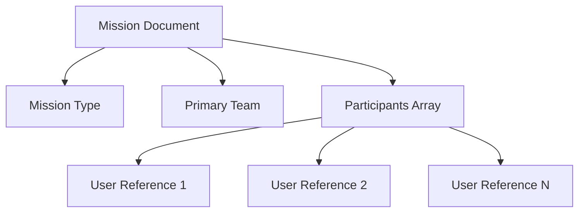
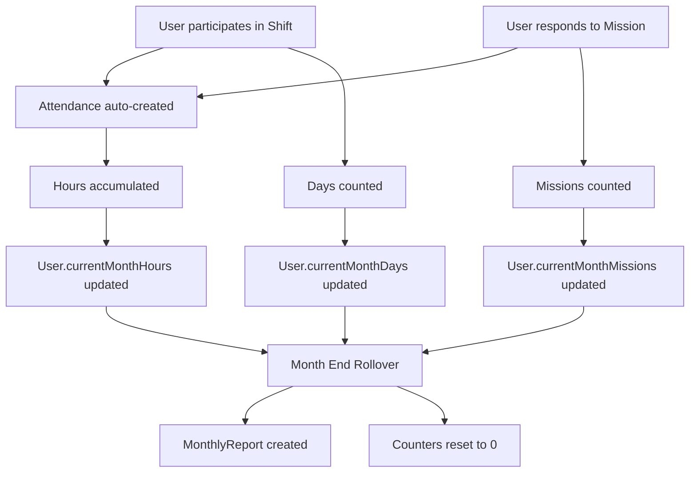
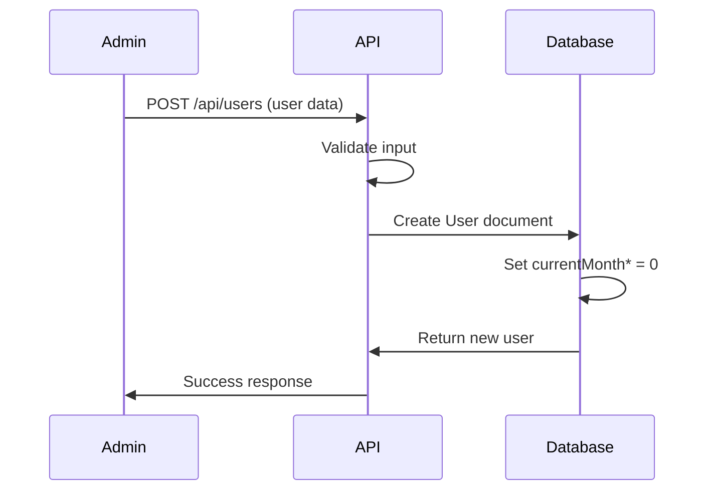
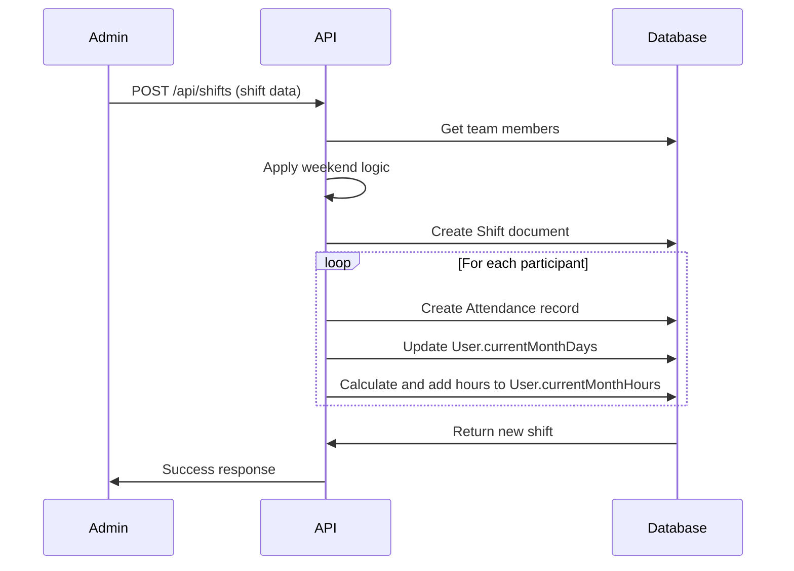
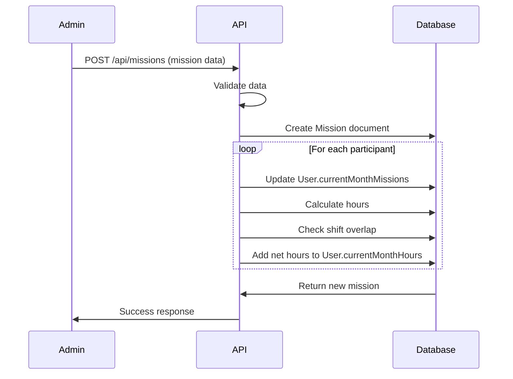
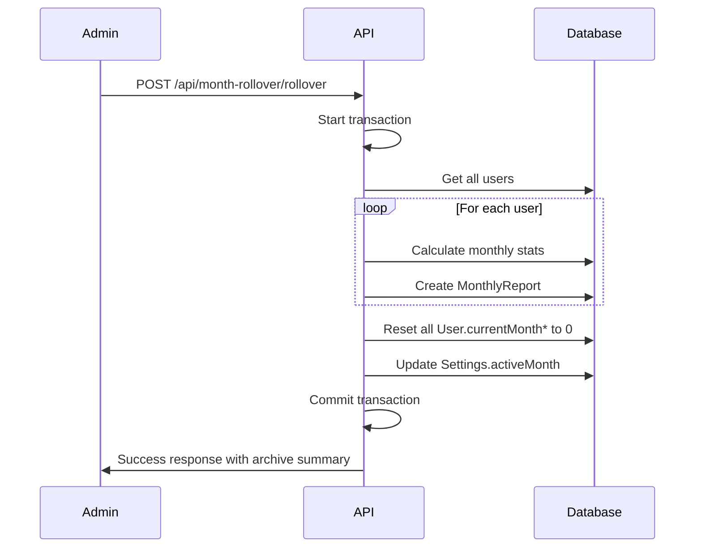
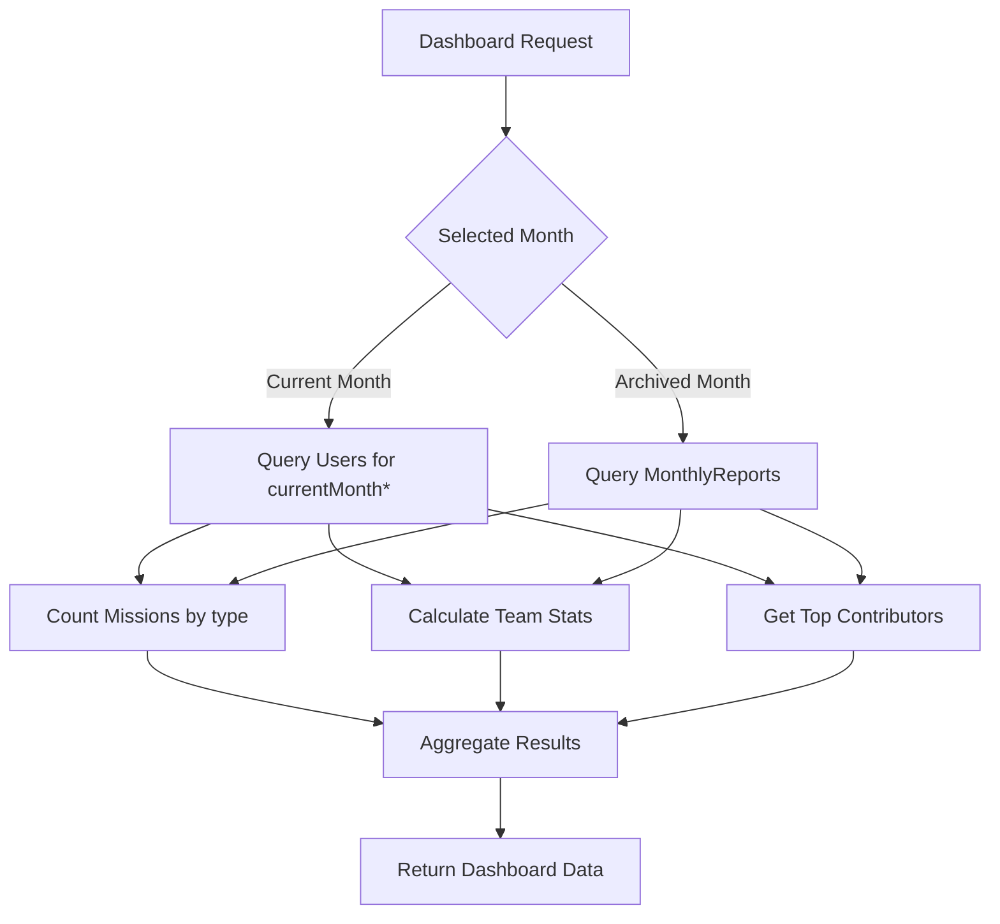

# Database Structure - Civil Defense Management System

## Table of Contents
1. [Overview](#overview)
2. [Entity Relationship Diagram](#entity-relationship-diagram)
3. [Collection Schemas](#collection-schemas)
4. [Relationships](#relationships)
5. [Indexes](#indexes)
6. [Data Flow](#data-flow)

---

## Overview

The Civil Defense Management System uses MongoDB as its database, leveraging its flexible document structure for efficient storage and retrieval of operational data. The database consists of 7 main collections that work together to provide comprehensive station management.

### Database Information
- **Database Name**: `civil-defense`
- **Database Type**: MongoDB (NoSQL)
- **Hosting**: MongoDB Atlas (Cloud)
- **Driver**: Mongoose ODM
- **Total Collections**: 7

### Design Principles
1. **Denormalization where appropriate** - Store frequently accessed data together
2. **Reference relationships** - Use ObjectIds for entity relationships
3. **Embedded documents** - For tightly coupled data (e.g., participants in missions)
4. **Indexing strategy** - Optimize for common query patterns
5. **Data integrity** - Enforce validation at schema level

---

## Entity Relationship Diagram



---

## Collection Schemas

### 1. Users Collection

**Purpose**: Stores personnel information for all Civil Defense members.

**Schema Definition**:
```typescript
interface User {
  _id: ObjectId;
  name: string;                    // Full name in Arabic
  role: 'volunteer' | 'employee' | 'head' | 'administrative staff';
  team: '1' | '2' | '3';           // Team assignment
  phoneNumber: string;              // Contact number
  emergencyContact: string;         // Emergency contact number
  dateOfBirth: Date;               // Birth date
  address: string;                 // Residential address
  currentMonthHours: number;       // Accumulated hours this month
  currentMonthMissions: number;    // Mission count this month
  currentMonthDays: number;        // Working days this month
  createdAt: Date;                 // Record creation timestamp
  updatedAt: Date;                 // Last update timestamp
}
```

**Validation Rules**:
```javascript
{
  name: {
    type: String,
    required: [true, 'Name is required'],
    trim: true,
    minlength: [2, 'Name must be at least 2 characters'],
    maxlength: [100, 'Name cannot exceed 100 characters']
  },
  role: {
    type: String,
    required: [true, 'Role is required'],
    enum: {
      values: ['volunteer', 'employee', 'head', 'administrative staff'],
      message: 'Invalid role specified'
    }
  },
  team: {
    type: String,
    required: [true, 'Team is required'],
    enum: {
      values: ['1', '2', '3'],
      message: 'Team must be 1, 2, or 3'
    }
  },
  phoneNumber: {
    type: String,
    required: [true, 'Phone number is required'],
    match: [/^[0-9+\-\s()]+$/, 'Invalid phone number format']
  },
  currentMonthHours: {
    type: Number,
    default: 0,
    min: [0, 'Hours cannot be negative']
  },
  currentMonthMissions: {
    type: Number,
    default: 0,
    min: [0, 'Missions cannot be negative']
  },
  currentMonthDays: {
    type: Number,
    default: 0,
    min: [0, 'Days cannot be negative']
  }
}
```

**Example Document**:
```json
{
  "_id": "507f1f77bcf86cd799439011",
  "name": "أحمد محمد",
  "role": "volunteer",
  "team": "1",
  "phoneNumber": "+961 3 123456",
  "emergencyContact": "+961 3 654321",
  "dateOfBirth": "1995-05-15T00:00:00.000Z",
  "address": "عرمون، لبنان",
  "currentMonthHours": 156.5,
  "currentMonthMissions": 23,
  "currentMonthDays": 15,
  "createdAt": "2024-01-15T10:30:00.000Z",
  "updatedAt": "2024-10-15T14:22:00.000Z"
}
```

**Indexes**:
```javascript
db.users.createIndex({ name: 1 });
db.users.createIndex({ role: 1, team: 1 });
db.users.createIndex({ createdAt: -1 });
```

---

### 2. Shifts Collection

**Purpose**: Records daily attendance shifts at the Civil Defense station.

**Schema Definition**:
```typescript
interface Shift {
  _id: ObjectId;
  date: string;                    // Shift date (YYYY-MM-DD)
  team: '1' | '2' | '3';           // Assigned team
  participants: Participant[];      // Array of participants
  createdAt: Date;
  updatedAt: Date;
}

interface Participant {
  user: ObjectId;                  // Reference to User
  checkIn: string;                 // Check-in time (YYYY-MM-DDTHH:mm)
  checkOut: string;                // Check-out time (YYYY-MM-DDTHH:mm)
  _id: ObjectId;                   // Subdocument ID
}
```

**Validation Rules**:
```javascript
{
  date: {
    type: String,
    required: [true, 'Date is required'],
    match: [/^\d{4}-\d{2}-\d{2}$/, 'Date must be in YYYY-MM-DD format']
  },
  team: {
    type: String,
    required: [true, 'Team is required'],
    enum: ['1', '2', '3']
  },
  participants: [{
    user: {
      type: mongoose.Schema.Types.ObjectId,
      ref: 'User',
      required: [true, 'User reference is required']
    },
    checkIn: {
      type: String,
      required: [true, 'Check-in time is required'],
      match: [/^\d{4}-\d{2}-\d{2}T\d{2}:\d{2}$/, 'Invalid datetime format']
    },
    checkOut: {
      type: String,
      required: [true, 'Check-out time is required'],
      match: [/^\d{4}-\d{2}-\d{2}T\d{2}:\d{2}$/, 'Invalid datetime format']
    }
  }]
}
```

**Example Document**:
```json
{
  "_id": "507f1f77bcf86cd799439022",
  "date": "2024-10-15",
  "team": "1",
  "participants": [
    {
      "_id": "507f1f77bcf86cd799439033",
      "user": "507f1f77bcf86cd799439011",
      "checkIn": "2024-10-15T08:00",
      "checkOut": "2024-10-16T08:00"
    },
    {
      "_id": "507f1f77bcf86cd799439034",
      "user": "507f1f77bcf86cd799439012",
      "checkIn": "2024-10-15T08:00",
      "checkOut": "2024-10-16T08:00"
    }
  ],
  "createdAt": "2024-10-15T07:30:00.000Z",
  "updatedAt": "2024-10-15T07:30:00.000Z"
}
```

**Indexes**:
```javascript
db.shifts.createIndex({ date: -1 });
db.shifts.createIndex({ team: 1, date: -1 });
db.shifts.createIndex({ 'participants.user': 1 });
```

---

### 3. Missions Collection

**Purpose**: Logs emergency response missions and operations.

**Schema Definition**:
```typescript
interface Mission {
  _id: ObjectId;
  referenceNumber: string;         // Official reference number
  vehicleNumber: string;           // Vehicles used (e.g., "101, 102")
  startTime: string;               // Mission start (YYYY-MM-DDTHH:mm)
  endTime: string;                 // Mission end (YYYY-MM-DDTHH:mm)
  location: string;                // Incident location
  missionType: 'fire' | 'rescue' | 'medic' | 'publicService' | 'misc';
  missionDetails: string;          // Specific details (e.g., "structural fire")
  notes: string;                   // Additional notes
  team: '1' | '2' | '3';           // Primary responding team
  participants: Participant[];      // Array of participants
  createdAt: Date;
  updatedAt: Date;
}

interface Participant {
  user: ObjectId;                  // Reference to User
  checkIn: string;                 // Participant join time
  checkOut: string;                // Participant completion time
  _id: ObjectId;
}
```

**Validation Rules**:
```javascript
{
  referenceNumber: {
    type: String,
    required: false,
    trim: true
  },
  vehicleNumber: {
    type: String,
    required: [true, 'Vehicle number is required'],
    trim: true
  },
  startTime: {
    type: String,
    required: [true, 'Start time is required'],
    match: [/^\d{4}-\d{2}-\d{2}T\d{2}:\d{2}$/, 'Invalid datetime format']
  },
  endTime: {
    type: String,
    required: [true, 'End time is required'],
    match: [/^\d{4}-\d{2}-\d{2}T\d{2}:\d{2}$/, 'Invalid datetime format']
  },
  location: {
    type: String,
    required: [true, 'Location is required'],
    trim: true
  },
  missionType: {
    type: String,
    required: [true, 'Mission type is required'],
    enum: {
      values: ['fire', 'rescue', 'medic', 'publicService', 'misc'],
      message: 'Invalid mission type'
    }
  },
  missionDetails: {
    type: String,
    trim: true
  },
  team: {
    type: String,
    required: [true, 'Team is required'],
    enum: ['1', '2', '3']
  },
  participants: [{
    user: {
      type: mongoose.Schema.Types.ObjectId,
      ref: 'User',
      required: [true, 'User reference is required']
    },
    checkIn: {
      type: String,
      required: [true, 'Check-in time is required']
    },
    checkOut: {
      type: String,
      required: [true, 'Check-out time is required']
    }
  }]
}
```

**Example Document**:
```json
{
  "_id": "507f1f77bcf86cd799439044",
  "referenceNumber": "REF-2024-1015-001",
  "vehicleNumber": "101, 103",
  "startTime": "2024-10-15T14:30",
  "endTime": "2024-10-15T16:45",
  "location": "شارع الرئيسي، عرمون",
  "missionType": "fire",
  "missionDetails": "حريق في مبنى سكني - الطابق الثالث",
  "notes": "تم إخماد الحريق بنجاح، لا إصابات",
  "team": "1",
  "participants": [
    {
      "_id": "507f1f77bcf86cd799439055",
      "user": "507f1f77bcf86cd799439011",
      "checkIn": "2024-10-15T14:30",
      "checkOut": "2024-10-15T16:45"
    },
    {
      "_id": "507f1f77bcf86cd799439056",
      "user": "507f1f77bcf86cd799439012",
      "checkIn": "2024-10-15T14:35",
      "checkOut": "2024-10-15T16:45"
    }
  ],
  "createdAt": "2024-10-15T14:25:00.000Z",
  "updatedAt": "2024-10-15T16:50:00.000Z"
}
```

**Indexes**:
```javascript
db.missions.createIndex({ startTime: -1 });
db.missions.createIndex({ missionType: 1 });
db.missions.createIndex({ team: 1, startTime: -1 });
db.missions.createIndex({ 'participants.user': 1 });
db.missions.createIndex({ referenceNumber: 1 }, { unique: true, sparse: true });
```

---

### 4. Attendance Collection

**Purpose**: Tracks individual daily attendance with status codes.

**Schema Definition**:
```typescript
interface Attendance {
  _id: ObjectId;
  userId: ObjectId;                // Reference to User
  date: string;                    // Attendance date (YYYY-MM-DD)
  code: string;                    // Attendance code (e.g., "حاضر", "غياب")
  isPresent: boolean;              // Quick presence check
  createdAt: Date;
  updatedAt: Date;
}
```

**Validation Rules**:
```javascript
{
  userId: {
    type: mongoose.Schema.Types.ObjectId,
    ref: 'User',
    required: [true, 'User ID is required']
  },
  date: {
    type: String,
    required: [true, 'Date is required'],
    match: [/^\d{4}-\d{2}-\d{2}$/, 'Date must be in YYYY-MM-DD format']
  },
  code: {
    type: String,
    required: [true, 'Attendance code is required'],
    trim: true
  },
  isPresent: {
    type: Boolean,
    default: false
  }
}
```

**Common Attendance Codes**:
| Code | Arabic | Meaning |
|------|--------|---------|
| present | حاضر | Present |
| absent | غياب | Absent |
| sick | إجازة مرضية | Sick Leave |
| vacation | إجازة | Vacation |
| excused | غياب مبرر | Excused Absence |

**Example Document**:
```json
{
  "_id": "507f1f77bcf86cd799439066",
  "userId": "507f1f77bcf86cd799439011",
  "date": "2024-10-15",
  "code": "حاضر",
  "isPresent": true,
  "createdAt": "2024-10-15T08:00:00.000Z",
  "updatedAt": "2024-10-15T08:00:00.000Z"
}
```

**Indexes**:
```javascript
db.attendance.createIndex({ userId: 1, date: -1 });
db.attendance.createIndex({ date: -1 });
db.attendance.createIndex({ userId: 1, date: 1 }, { unique: true });
```

---

### 5. MonthlyReports Collection

**Purpose**: Archives monthly performance statistics for each user.

**Schema Definition**:
```typescript
interface MonthlyReport {
  _id: ObjectId;
  userId: ObjectId;                // Reference to User
  month: number;                   // Month number (1-12)
  year: number;                    // Year (e.g., 2024)
  totalHours: number;              // Total hours worked
  totalMissions: number;           // Total missions participated
  totalDays: number;               // Total working days
  missionTypeCounts: {
    fire: number;
    rescue: number;
    medic: number;
    publicService: number;
    misc: number;
  };
  createdAt: Date;
  updatedAt: Date;
}
```

**Validation Rules**:
```javascript
{
  userId: {
    type: mongoose.Schema.Types.ObjectId,
    ref: 'User',
    required: [true, 'User ID is required']
  },
  month: {
    type: Number,
    required: [true, 'Month is required'],
    min: [1, 'Month must be between 1 and 12'],
    max: [12, 'Month must be between 1 and 12']
  },
  year: {
    type: Number,
    required: [true, 'Year is required'],
    min: [2020, 'Year must be 2020 or later']
  },
  totalHours: {
    type: Number,
    required: [true, 'Total hours is required'],
    min: [0, 'Hours cannot be negative']
  },
  totalMissions: {
    type: Number,
    required: [true, 'Total missions is required'],
    min: [0, 'Missions cannot be negative']
  },
  totalDays: {
    type: Number,
    required: [true, 'Total days is required'],
    min: [0, 'Days cannot be negative']
  },
  missionTypeCounts: {
    fire: { type: Number, default: 0, min: 0 },
    rescue: { type: Number, default: 0, min: 0 },
    medic: { type: Number, default: 0, min: 0 },
    publicService: { type: Number, default: 0, min: 0 },
    misc: { type: Number, default: 0, min: 0 }
  }
}
```

**Example Document**:
```json
{
  "_id": "507f1f77bcf86cd799439077",
  "userId": "507f1f77bcf86cd799439011",
  "month": 10,
  "year": 2024,
  "totalHours": 156.5,
  "totalMissions": 23,
  "totalDays": 15,
  "missionTypeCounts": {
    "fire": 5,
    "rescue": 8,
    "medic": 6,
    "publicService": 3,
    "misc": 1
  },
  "createdAt": "2024-11-01T00:00:00.000Z",
  "updatedAt": "2024-11-01T00:00:00.000Z"
}
```

**Indexes**:
```javascript
db.monthlyreports.createIndex({ userId: 1, year: -1, month: -1 });
db.monthlyreports.createIndex({ year: -1, month: -1 });
db.monthlyreports.createIndex({ userId: 1, year: -1, month: -1 }, { unique: true });
```

---

### 6. Settings Collection

**Purpose**: Stores system-wide configuration, primarily active month/year.

**Schema Definition**:
```typescript
interface Settings {
  _id: ObjectId;
  activeMonth: number;             // Current active month (1-12)
  activeYear: number;              // Current active year (e.g., 2024)
  createdAt: Date;
  updatedAt: Date;
}
```

**Validation Rules**:
```javascript
{
  activeMonth: {
    type: Number,
    required: [true, 'Active month is required'],
    min: [1, 'Month must be between 1 and 12'],
    max: [12, 'Month must be between 1 and 12']
  },
  activeYear: {
    type: Number,
    required: [true, 'Active year is required'],
    min: [2020, 'Year must be 2020 or later']
  }
}
```

**Example Document**:
```json
{
  "_id": "507f1f77bcf86cd799439088",
  "activeMonth": 11,
  "activeYear": 2024,
  "createdAt": "2024-01-01T00:00:00.000Z",
  "updatedAt": "2024-11-01T00:00:00.000Z"
}
```

**Notes**:
- Only one Settings document should exist in the collection
- Updated during month rollover process
- Read frequently, written infrequently

**Indexes**:
```javascript
// No special indexes needed (single document collection)
```

---

### 7. Admins Collection

**Purpose**: Manages administrator authentication and authorization.

**Schema Definition**:
```typescript
interface Admin {
  _id: ObjectId;
  email: string;                   // Admin email (unique)
  password: string;                // Hashed password (bcrypt)
  name: string;                    // Admin name
  resetToken?: string;             // Password reset token (temporary)
  resetTokenExpiry?: Date;         // Token expiration time
  createdAt: Date;
  updatedAt: Date;
}
```

**Validation Rules**:
```javascript
{
  email: {
    type: String,
    required: [true, 'Email is required'],
    unique: true,
    lowercase: true,
    trim: true,
    match: [/^\S+@\S+\.\S+$/, 'Invalid email format']
  },
  password: {
    type: String,
    required: [true, 'Password is required'],
    minlength: [8, 'Password must be at least 8 characters']
  },
  name: {
    type: String,
    required: [true, 'Name is required'],
    trim: true
  },
  resetToken: {
    type: String
  },
  resetTokenExpiry: {
    type: Date
  }
}
```

**Security Notes**:
- Passwords are hashed using bcrypt with 10 salt rounds
- Reset tokens are generated using crypto.randomBytes
- Tokens expire after 15 minutes
- Passwords never stored in plain text

**Example Document**:
```json
{
  "_id": "507f1f77bcf86cd799439099",
  "email": "admin@civildefense.online",
  "password": "$2b$10$xyz123...hashedpassword...abc789",
  "name": "Station Administrator",
  "createdAt": "2024-01-15T10:00:00.000Z",
  "updatedAt": "2024-10-15T14:30:00.000Z"
}
```

**Indexes**:
```javascript
db.admins.createIndex({ email: 1 }, { unique: true });
db.admins.createIndex({ resetToken: 1 }, { sparse: true });
```

---

## Relationships

### User Relationships



**Description**:
- One User can participate in many Shifts
- One User can respond to many Missions
- One User has many Attendance records
- One User generates many MonthlyReports (one per month)

### Shift Relationships



**Description**:
- One Shift belongs to one Team
- One Shift contains many Participants
- Each Participant references one User
- Participant data is embedded (not separate collection)

### Mission Relationships



**Description**:
- One Mission has one Mission Type
- One Mission is assigned to one Primary Team
- One Mission contains many Participants
- Each Participant references one User
- Participant data is embedded

### Data Aggregation Flow



---

## Indexes

### Index Strategy

The system uses strategic indexing to optimize query performance:

#### User Collection Indexes
```javascript
// Index for name searches (user list filtering)
db.users.createIndex({ name: 1 });

// Compound index for role and team filtering
db.users.createIndex({ role: 1, team: 1 });

// Index for sorting by creation date
db.users.createIndex({ createdAt: -1 });
```

**Query Optimization**:
- Name index: Supports text search in user list
- Role+Team index: Filters for team-specific operations
- CreatedAt index: Recent users first in listings

#### Shift Collection Indexes
```javascript
// Primary query: Get shifts by date (descending)
db.shifts.createIndex({ date: -1 });

// Team-specific shift queries
db.shifts.createIndex({ team: 1, date: -1 });

// User participation lookup
db.shifts.createIndex({ 'participants.user': 1 });
```

**Query Optimization**:
- Date index: Dashboard and shift list queries
- Team+Date index: Team-specific shift history
- Participants index: Find all shifts for a specific user

#### Mission Collection Indexes
```javascript
// Primary query: Recent missions first
db.missions.createIndex({ startTime: -1 });

// Mission type filtering (analytics)
db.missions.createIndex({ missionType: 1 });

// Team-specific mission queries
db.missions.createIndex({ team: 1, startTime: -1 });

// User participation lookup
db.missions.createIndex({ 'participants.user': 1 });

// Unique reference numbers (sparse for optional field)
db.missions.createIndex(
  { referenceNumber: 1 }, 
  { unique: true, sparse: true }
);
```

**Query Optimization**:
- StartTime index: Mission list and dashboard queries
- MissionType index: Analytics and reporting
- Team+StartTime index: Team performance analysis
- Participants index: User mission history
- ReferenceNumber index: Prevents duplicate references

#### Attendance Collection Indexes
```javascript
// Primary query: User's attendance history
db.attendance.createIndex({ userId: 1, date: -1 });

// Date-based queries (monthly calendar)
db.attendance.createIndex({ date: -1 });

// Prevent duplicate attendance records
db.attendance.createIndex(
  { userId: 1, date: 1 }, 
  { unique: true }
);
```

**Query Optimization**:
- UserId+Date index: User attendance calendar
- Date index: All attendance for specific date
- Unique constraint: Prevents data integrity issues

#### MonthlyReports Collection Indexes
```javascript
// Primary query: User's historical reports
db.monthlyreports.createIndex({ userId: 1, year: -1, month: -1 });

// All reports for specific month
db.monthlyreports.createIndex({ year: -1, month: -1 });

// Prevent duplicate monthly reports
db.monthlyreports.createIndex(
  { userId: 1, year: -1, month: -1 }, 
  { unique: true }
);
```

**Query Optimization**:
- UserId+Year+Month index: User report history
- Year+Month index: System-wide monthly statistics
- Unique constraint: One report per user per month

#### Admin Collection Indexes
```javascript
// Login queries
db.admins.createIndex({ email: 1 }, { unique: true });

// Password reset token lookup
db.admins.createIndex({ resetToken: 1 }, { sparse: true });
```

**Query Optimization**:
- Email index: Fast login authentication
- ResetToken index: Password reset flow
- Sparse index: Only for documents with resetToken

---

## Data Flow

### 1. User Creation Flow



### 2. Shift Creation Flow



### 3. Mission Logging Flow



### 4. Hour Calculation Logic

**Preventing Double-Counting**:

```typescript
// Pseudocode for hour calculation with overlap detection
function calculateNetHours(userId, mission) {
  // 1. Get mission hours
  const missionHours = calculateHours(mission.checkIn, mission.checkOut);
  
  // 2. Find overlapping shifts on same day
  const overlappingShifts = findOverlappingShifts(
    userId, 
    mission.checkIn, 
    mission.checkOut
  );
  
  // 3. Calculate overlap duration
  let overlapHours = 0;
  for (const shift of overlappingShifts) {
    const overlap = calculateOverlap(
      mission.checkIn, 
      mission.checkOut,
      shift.checkIn,
      shift.checkOut
    );
    overlapHours += overlap;
  }
  
  // 4. Net hours = mission hours - overlap
  const netHours = missionHours - overlapHours;
  
  return Math.max(netHours, 0); // Never negative
}
```

**Example Scenario**:
```
User has shift: 8:00 AM - 8:00 PM (12 hours)
Mission occurs: 2:00 PM - 5:00 PM (3 hours)

Overlap: 2:00 PM - 5:00 PM (3 hours)

Hours added to user:
- From shift: 12 hours
- From mission: 3 - 3 (overlap) = 0 hours
- Total: 12 hours (not 15!)
```

### 5. Month Rollover Flow



### 6. Dashboard Data Flow



---

## Best Practices

### 1. Data Integrity

**Always use transactions for critical operations**:
```typescript
const session = await mongoose.startSession();
session.startTransaction();

try {
  // Multiple database operations
  await User.updateOne({ _id: userId }, { $inc: { currentMonthHours: 5 } }, { session });
  await Attendance.create([{ userId, date, code: 'حاضر' }], { session });
  
  await session.commitTransaction();
} catch (error) {
  await session.abortTransaction();
  throw error;
} finally {
  session.endSession();
}
```

### 2. Query Optimization

**Use projections to limit returned fields**:
```typescript
// BAD - Returns entire document
const users = await User.find();

// GOOD - Returns only needed fields
const users = await User.find({}, 'name role team currentMonthHours');
```

**Use lean() for read-only operations**:
```typescript
// Returns plain JavaScript objects (faster)
const users = await User.find().lean();
```

### 3. Indexing Guidelines

- Index fields used in query filters
- Index fields used in sorting
- Use compound indexes for multiple field queries
- Avoid over-indexing (slows down writes)
- Monitor slow queries with MongoDB profiler

### 4. Data Validation

- Always validate at schema level
- Add custom validators for complex rules
- Sanitize user input before storage
- Use enum for fixed value fields

---

## Conclusion

This database structure provides:
- ✅ Efficient data storage and retrieval
- ✅ Data integrity through validation and relationships
- ✅ Optimized query performance with strategic indexing
- ✅ Scalability for future growth
- ✅ Clear separation of concerns across collections

For questions or clarifications, contact:
- **Developer**: Adam Dakdouk
- **Email**: adamdakdouk2003@gmail.com
- **LinkedIn**: [linkedin.com/in/adamdakdouk](https://www.linkedin.com/in/adamdakdouk/)

---

**Document Version**: 1.0.0  
**Last Updated**: November 2025