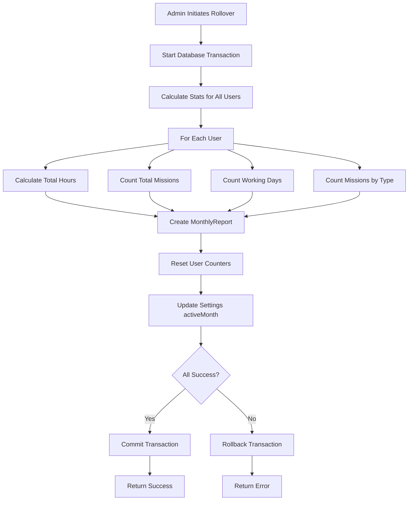

# Reports & Logic - Civil Defense Management System

## Table of Contents
1. [Overview](#overview)
2. [Hour Calculation System](#hour-calculation-system)
3. [Overlap Detection Logic](#overlap-detection-logic)
4. [Mission Counting Rules](#mission-counting-rules)
5. [Working Days Calculation](#working-days-calculation)
6. [Monthly Rollover Process](#monthly-rollover-process)
7. [Team Rotation Logic](#team-rotation-logic)
8. [Weekend Scheduling Rules](#weekend-scheduling-rules)
9. [Report Generation](#report-generation)
10. [Edge Cases & Solutions](#edge-cases--solutions)

---

## Overview

The Civil Defense Management System implements sophisticated business logic to accurately track volunteer and employee contributions while preventing data inconsistencies. This document details the calculation rules, algorithms, and edge case handling.

### Key Principles

1. **Accuracy First**: All calculations must be mathematically correct
2. **No Double-Counting**: Hours counted once even if overlap occurs
3. **Fair Attribution**: Credit given for actual time worked
4. **Data Integrity**: Transactions ensure consistency
5. **Auditability**: All changes tracked with timestamps

---

## Hour Calculation System

### Basic Hour Calculation

Hours are calculated as the difference between check-in and check-out times.

**Formula**:
```typescript
hours = (checkOut - checkIn) / (1000 * 60 * 60)
```

**Example 1: Same-Day Shift**
```typescript
checkIn  = "2024-10-15T08:00"
checkOut = "2024-10-15T16:00"

hours = (16:00 - 08:00) / 1 hour
hours = 8.00
```

**Example 2: Overnight Shift**
```typescript
checkIn  = "2024-10-15T20:00"
checkOut = "2024-10-16T08:00"

hours = (next day 08:00 - today 20:00) / 1 hour
hours = 12.00
```

**Example 3: Multi-Day Shift**
```typescript
checkIn  = "2024-10-15T08:00"
checkOut = "2024-10-17T08:00"

hours = (48 hours later) / 1 hour
hours = 48.00
```

### Rounding Rules

- Round to 2 decimal places
- Use standard rounding (0.5 rounds up)
- Examples:
  - 8.125 hours → 8.13 hours
  - 4.444 hours → 4.44 hours
  - 12.999 hours → 13.00 hours

### Implementation

```typescript
function calculateHours(checkIn: string, checkOut: string): number {
  const start = new Date(checkIn);
  const end = new Date(checkOut);
  
  if (end <= start) {
    throw new Error('Check-out must be after check-in');
  }
  
  const milliseconds = end.getTime() - start.getTime();
  const hours = milliseconds / (1000 * 60 * 60);
  
  return Math.round(hours * 100) / 100; // Round to 2 decimals
}
```

---

## Overlap Detection Logic

### The Problem

When a user participates in both a shift AND a mission during the same time period, we must ensure hours are not counted twice.

**Scenario**:
```
Shift:   08:00 ─────────────────────────── 20:00  (12 hours)
Mission:            14:00 ──────── 17:00            (3 hours)
                         ╰── Overlap ──╯
```

**Without Overlap Detection**:
- Shift hours: 12
- Mission hours: 3
- Total: 15 hours ❌ WRONG

**With Overlap Detection**:
- Shift hours: 12
- Mission hours: 3 - 3 (overlap) = 0
- Total: 12 hours ✅ CORRECT

### Overlap Detection Algorithm

```typescript
function detectOverlap(
  period1Start: string,
  period1End: string,
  period2Start: string,
  period2End: string
): number {
  const start1 = new Date(period1Start);
  const end1 = new Date(period1End);
  const start2 = new Date(period2Start);
  const end2 = new Date(period2End);
  
  // Find overlap start (later of two starts)
  const overlapStart = start1 > start2 ? start1 : start2;
  
  // Find overlap end (earlier of two ends)
  const overlapEnd = end1 < end2 ? end1 : end2;
  
  // If no overlap, return 0
  if (overlapStart >= overlapEnd) {
    return 0;
  }
  
  // Calculate overlap duration
  const overlapMs = overlapEnd.getTime() - overlapStart.getTime();
  const overlapHours = overlapMs / (1000 * 60 * 60);
  
  return Math.round(overlapHours * 100) / 100;
}
```

### Overlap Scenarios

#### Scenario 1: Complete Overlap (Mission inside Shift)
```
Shift:   08:00 ═══════════════════════════ 20:00
Mission:            14:00 ───── 17:00

Overlap: 14:00 to 17:00 = 3 hours
Mission net hours: 3 - 3 = 0
```

#### Scenario 2: Partial Overlap (Mission extends before)
```
Shift:         10:00 ═══════════════════════ 20:00
Mission:  08:00 ────────── 12:00

Overlap: 10:00 to 12:00 = 2 hours
Mission net hours: 4 - 2 = 2
```

#### Scenario 3: Partial Overlap (Mission extends after)
```
Shift:   08:00 ═══════════════════════ 18:00
Mission:             14:00 ─────────────────── 21:00

Overlap: 14:00 to 18:00 = 4 hours
Mission net hours: 7 - 4 = 3
```

#### Scenario 4: No Overlap
```
Shift:   08:00 ══════════ 16:00
Mission:                        18:00 ──── 20:00

Overlap: None = 0 hours
Mission net hours: 2 - 0 = 2
```

#### Scenario 5: Multiple Shifts on Same Day
```
Shift 1: 08:00 ═══════ 12:00
Shift 2:               13:00 ═══════ 17:00
Mission:        10:00 ─────────────────── 16:00

Overlap with Shift 1: 10:00 to 12:00 = 2 hours
Overlap with Shift 2: 13:00 to 16:00 = 3 hours
Total overlap: 2 + 3 = 5 hours
Mission net hours: 6 - 5 = 1
```

### Net Hours Calculation

```typescript
async function calculateNetMissionHours(
  userId: string,
  missionCheckIn: string,
  missionCheckOut: string
): Promise<number> {
  // 1. Calculate raw mission hours
  const missionHours = calculateHours(missionCheckIn, missionCheckOut);
  
  // 2. Extract date from mission times
  const missionDate = missionCheckIn.substring(0, 10);
  
  // 3. Find all shifts for this user on this date
  const shifts = await Shift.find({
    'participants.user': userId,
    date: missionDate
  });
  
  // 4. Calculate total overlap with all shifts
  let totalOverlap = 0;
  
  for (const shift of shifts) {
    const participant = shift.participants.find(
      p => p.user.toString() === userId
    );
    
    if (participant) {
      const overlap = detectOverlap(
        participant.checkIn,
        participant.checkOut,
        missionCheckIn,
        missionCheckOut
      );
      
      totalOverlap += overlap;
    }
  }
  
  // 5. Net hours = mission hours - overlap
  const netHours = Math.max(missionHours - totalOverlap, 0);
  
  return Math.round(netHours * 100) / 100;
}
```

---

## Mission Counting Rules

### When to Count a Mission

A mission is counted for a user if:
1. User is listed in the mission's participants array
2. User has valid check-in and check-out times
3. Mission is in the current active month (or queried month)

### Mission Type Breakdown

The system tracks missions by type for reporting:

| Type | Arabic | Counted In Reports |
|------|--------|-------------------|
| fire | حريق | ✅ Yes |
| rescue | إنقاذ | ✅ Yes |
| medic | طبي | ✅ Yes |
| publicService | خدمة عامة | ✅ Yes |
| misc | متفرقات | ✅ Yes |

### Implementation

```typescript
async function countUserMissions(
  userId: string,
  month: number,
  year: number
): Promise<{ total: number; byType: MissionTypeCounts }> {
  // Build date range for month
  const startDate = `${year}-${String(month).padStart(2, '0')}-01`;
  const endMonth = month === 12 ? 1 : month + 1;
  const endYear = month === 12 ? year + 1 : year;
  const endDate = `${endYear}-${String(endMonth).padStart(2, '0')}-01`;
  
  // Find all missions where user participated
  const missions = await Mission.find({
    'participants.user': userId,
    startTime: {
      $gte: startDate,
      $lt: endDate
    }
  });
  
  // Count by type
  const byType = {
    fire: 0,
    rescue: 0,
    medic: 0,
    publicService: 0,
    misc: 0
  };
  
  missions.forEach(mission => {
    if (byType.hasOwnProperty(mission.missionType)) {
      byType[mission.missionType]++;
    }
  });
  
  return {
    total: missions.length,
    byType
  };
}
```

---

## Working Days Calculation

### Definition of a Working Day

A day is counted as a "working day" for a user if:
1. User participated in at least one shift on that day, OR
2. User participated in at least one mission on that day

### Preventing Double-Counting of Days

If a user has both a shift AND a mission on the same day, it counts as only ONE working day.

### Implementation

```typescript
async function countWorkingDays(
  userId: string,
  month: number,
  year: number
): Promise<number> {
  const startDate = `${year}-${String(month).padStart(2, '0')}-01`;
  const endMonth = month === 12 ? 1 : month + 1;
  const endYear = month === 12 ? year + 1 : year;
  const endDate = `${endYear}-${String(endMonth).padStart(2, '0')}-01`;
  
  // Get all shifts and missions for user in month
  const shifts = await Shift.find({
    'participants.user': userId,
    date: { $gte: startDate, $lt: endDate }
  });
  
  const missions = await Mission.find({
    'participants.user': userId,
    startTime: { $gte: startDate, $lt: endDate }
  });
  
  // Collect unique dates
  const uniqueDates = new Set<string>();
  
  // Add shift dates
  shifts.forEach(shift => {
    uniqueDates.add(shift.date);
  });
  
  // Add mission dates (extract date from startTime)
  missions.forEach(mission => {
    const date = mission.startTime.substring(0, 10);
    uniqueDates.add(date);
  });
  
  return uniqueDates.size;
}
```

### Example

```
October 2024:
- Oct 1: Shift only → 1 day
- Oct 2: Mission only → 1 day
- Oct 3: Shift + Mission → 1 day (not 2!)
- Oct 4: Nothing → 0 days
- Oct 5: Shift only → 1 day

Total working days: 4
```

---

## Monthly Rollover Process

### When to Rollover

Month rollover should occur:
- At the end of each calendar month
- After all data entry is complete
- Before starting operations in the new month

### Rollover Steps



### Implementation

```typescript
async function performMonthRollover(): Promise<RolloverSummary> {
  const session = await mongoose.startSession();
  session.startTransaction();
  
  try {
    // 1. Get current active month/year
    const settings = await Settings.findOne().session(session);
    const currentMonth = settings.activeMonth;
    const currentYear = settings.activeYear;
    
    // 2. Get all users
    const users = await User.find().session(session);
    
    let reportsCreated = 0;
    
    // 3. Process each user
    for (const user of users) {
      // Calculate monthly statistics
      const totalHours = await calculateTotalHours(
        user._id,
        currentMonth,
        currentYear,
        session
      );
      
      const missionCounts = await countUserMissions(
        user._id,
        currentMonth,
        currentYear,
        session
      );
      
      const workingDays = await countWorkingDays(
        user._id,
        currentMonth,
        currentYear,
        session
      );
      
      // Create monthly report
      await MonthlyReport.create([{
        userId: user._id,
        month: currentMonth,
        year: currentYear,
        totalHours: totalHours,
        totalMissions: missionCounts.total,
        totalDays: workingDays,
        missionTypeCounts: missionCounts.byType
      }], { session });
      
      reportsCreated++;
    }
    
    // 4. Reset all user counters
    await User.updateMany(
      {},
      {
        $set: {
          currentMonthHours: 0,
          currentMonthMissions: 0,
          currentMonthDays: 0
        }
      },
      { session }
    );
    
    // 5. Advance active month
    const newMonth = currentMonth === 12 ? 1 : currentMonth + 1;
    const newYear = currentMonth === 12 ? currentYear + 1 : currentYear;
    
    await Settings.findOneAndUpdate(
      {},
      {
        $set: {
          activeMonth: newMonth,
          activeYear: newYear
        }
      },
      { session, new: true }
    );
    
    // 6. Commit transaction
    await session.commitTransaction();
    
    return {
      success: true,
      previousMonth: currentMonth,
      previousYear: currentYear,
      newMonth: newMonth,
      newYear: newYear,
      usersProcessed: users.length,
      reportsCreated: reportsCreated
    };
    
  } catch (error) {
    await session.abortTransaction();
    throw error;
  } finally {
    session.endSession();
  }
}
```

### Data Preservation

During rollover:
- ✅ Shifts remain unchanged
- ✅ Missions remain unchanged
- ✅ Attendance records remain unchanged
- ✅ MonthlyReports created (new data)
- ✅ User counters reset to 0
- ✅ Settings updated to new month

**Nothing is deleted** - all historical data is preserved.

---

## Team Rotation Logic

### Team Assignment

Users are assigned to one of three teams:
- Team 1
- Team 2
- Team 3

### Shift Creation with Team Pre-filling

When creating a shift for a specific team, the system automatically suggests team members:

```typescript
async function getTeamMembers(team: string, isWeekend: boolean): Promise<User[]> {
  // Base query: users on this team
  const query: any = { team };
  
  if (isWeekend) {
    // Weekend: only head and administrative staff
    query.role = {
      $in: ['head', 'administrative staff']
    };
  }
  
  // Get users
  const users = await User.find(query).sort({ name: 1 });
  
  return users;
}
```

### Weekend Scheduling Rules

**Weekdays (Monday-Friday)**:
- All team members available for shifts
- Volunteers, employees, head staff, admin staff

**Weekends (Saturday-Sunday)**:
- Only head staff and administrative staff
- Volunteers and regular employees typically not on weekend shifts

### Implementation

```typescript
function isWeekend(date: string): boolean {
  const d = new Date(date);
  const day = d.getDay(); // 0 = Sunday, 6 = Saturday
  return day === 0 || day === 6;
}

async function createShiftWithTeamPrefill(
  date: string,
  team: string
): Promise<{ suggestedParticipants: User[] }> {
  const weekend = isWeekend(date);
  const suggestedParticipants = await getTeamMembers(team, weekend);
  
  return {
    suggestedParticipants
  };
}
```

---

## Weekend Scheduling Rules

### Weekday Shift Example
```typescript
Date: "2024-10-15" (Tuesday)
Team: "1"

Suggested Participants:
✅ أحمد محمد (volunteer, team 1)
✅ محمد علي (employee, team 1)
✅ Station Head (head, team 1)
✅ Admin Assistant (administrative staff, team 1)
```

### Weekend Shift Example
```typescript
Date: "2024-10-19" (Saturday)
Team: "1"

Suggested Participants:
❌ أحمد محمد (volunteer, team 1) - Not available on weekends
❌ محمد علي (employee, team 1) - Not available on weekends
✅ Station Head (head, team 1)
✅ Admin Assistant (administrative staff, team 1)
```

---

## Report Generation

### Individual User Report

```typescript
interface UserMonthlyReport {
  userId: string;
  userName: string;
  month: number;
  year: number;
  
  // Summary Statistics
  totalHours: number;
  totalMissions: number;
  totalDays: number;
  
  // Mission Breakdown
  missionTypeCounts: {
    fire: number;
    rescue: number;
    medic: number;
    publicService: number;
    misc: number;
  };
  
  // Performance Metrics
  averageHoursPerDay: number;
  averageMissionsPerDay: number;
  
  // Team Context
  team: string;
  role: string;
}
```

### Team Performance Report

```typescript
interface TeamPerformanceReport {
  team: string;
  month: number;
  year: number;
  
  // Team Totals
  totalHours: number;
  totalMissions: number;
  totalWorkingDays: number;
  
  // Member Statistics
  memberCount: number;
  volunteerCount: number;
  employeeCount: number;
  
  // Averages
  averageHoursPerMember: number;
  averageMissionsPerMember: number;
  
  // Mission Type Distribution
  missionsByType: {
    fire: number;
    rescue: number;
    medic: number;
    publicService: number;
    misc: number;
  };
}
```

### Station-Wide Report

```typescript
interface StationReport {
  month: number;
  year: number;
  
  // Overall Statistics
  totalHours: number;
  totalMissions: number;
  totalWorkingDays: number;
  totalPersonnel: number;
  
  // Team Breakdown
  teams: {
    team1: TeamPerformanceReport;
    team2: TeamPerformanceReport;
    team3: TeamPerformanceReport;
  };
  
  // Top Performers (volunteers only)
  topContributors: {
    byHours: UserMonthlyReport[];
    byMissions: UserMonthlyReport[];
    byDays: UserMonthlyReport[];
  };
  
  // Mission Analysis
  missionsByType: {
    fire: number;
    rescue: number;
    medic: number;
    publicService: number;
    misc: number;
  };
  
  // Trends
  dailyActivity: {
    date: string;
    missionCount: number;
    hoursWorked: number;
  }[];
}
```

---

## Edge Cases & Solutions

### Edge Case 1: Mission Starts Before Midnight, Ends After

**Problem**:
```
Mission: 2024-10-15 23:30 → 2024-10-16 02:00
Which day does this count for?
```

**Solution**:
Count for the day the mission **started**:
```typescript
const missionDate = mission.startTime.substring(0, 10);
// Result: "2024-10-15"
```

---

### Edge Case 2: User Participates Multiple Times in Same Mission

**Problem**:
```
Mission has same user listed twice in participants array
Should hours be counted twice?
```

**Solution**:
Prevent duplicate participants at creation:
```typescript
function validateParticipants(participants: Participant[]): void {
  const userIds = participants.map(p => p.user.toString());
  const uniqueUserIds = new Set(userIds);
  
  if (userIds.length !== uniqueUserIds.size) {
    throw new Error('Duplicate participants not allowed');
  }
}
```

---

### Edge Case 3: Shift/Mission Edited After Month Rollover

**Problem**:
```
October data rolled over to archive
Admin edits October shift in November
Should archived report be updated?
```

**Solution**:
Archived reports are **immutable**. Historical data corrections require:
1. Manual correction in MonthlyReports collection
2. Administrative approval
3. Audit log entry

---

### Edge Case 4: User Deleted Mid-Month

**Problem**:
```
User has worked 100 hours this month
User gets deleted
Should their contributions still count?
```

**Solution**:
Implement soft delete:
```typescript
interface User {
  // ... other fields
  isDeleted: boolean;
  deletedAt?: Date;
}

// Filter deleted users from active lists
const activeUsers = await User.find({ isDeleted: { $ne: true } });

// Include deleted users in historical reports
const allUsers = await User.find(); // For month rollover
```

---

### Edge Case 5: Clock Changes (Daylight Saving Time)

**Problem**:
```
Shift: 2024-03-31 02:00 → 2024-03-31 03:00
On this date, clocks spring forward 1 hour
How many hours did user work?
```

**Solution**:
Custom Clock System eliminates this problem entirely:
- All times stored as strings without timezone
- Hour calculations based on wall-clock time
- No DST adjustments needed

---

### Edge Case 6: Negative Hours After Overlap

**Problem**:
```
Mission: 14:00 → 17:00 (3 hours)
Overlapping shift: 13:00 → 18:00 (5 hours)
Overlap: 3 hours
Net mission hours: 3 - 3 = 0 ✅ Correct

But what if there's a calculation error and overlap > mission hours?
```

**Solution**:
Use `Math.max()` to prevent negative values:
```typescript
const netHours = Math.max(missionHours - totalOverlap, 0);
// Ensures result is never negative
```

---

### Edge Case 7: Month Rollover on Last Day of Month

**Problem**:
```
It's October 31st, 11:59 PM
Admin clicks "Close Month"
User adds mission at October 31st, 11:58 PM (just before)
Which month does mission belong to?
```

**Solution**:
Use database transactions to ensure atomicity:
```typescript
// Start transaction
await session.startTransaction();

// Lock Settings document
const settings = await Settings.findOneAndUpdate(
  {},
  { $set: { isRollingOver: true } },
  { session }
);

// Prevent new entries during rollover
if (settings.isRollingOver) {
  throw new Error('Month rollover in progress');
}

// Perform rollover...

// Commit transaction
await session.commitTransaction();
```

---

## Calculation Examples

### Example 1: Simple Volunteer Month

**User**: Ahmad (Volunteer, Team 1)
**Month**: October 2024

**Activity**:
- 3 shifts: Oct 1, Oct 8, Oct 15 (8 hours each)
- 5 missions: Oct 3, Oct 10, Oct 12, Oct 18, Oct 25 (2 hours each)
- Oct 8 mission overlaps with shift (2 hours overlap)

**Calculations**:
```
Shift Hours:
- Oct 1: 8 hours
- Oct 8: 8 hours
- Oct 15: 8 hours
Total shift hours: 24

Mission Hours:
- Oct 3: 2 hours (no overlap)
- Oct 8: 2 - 2 = 0 hours (full overlap with shift)
- Oct 10: 2 hours (no overlap)
- Oct 12: 2 hours (no overlap)
- Oct 18: 2 hours (no overlap)
- Oct 25: 2 hours (no overlap)
Total mission net hours: 10

Total Hours: 24 + 10 = 34 hours

Working Days:
- Shifts: Oct 1, 8, 15 = 3 days
- Missions: Oct 3, 8, 10, 12, 18, 25 = 6 days
- Oct 8 counted once (shift + mission same day)
Total working days: 8 days

Total Missions: 5
```

**Monthly Report**:
```json
{
  "userId": "...",
  "month": 10,
  "year": 2024,
  "totalHours": 34.00,
  "totalMissions": 5,
  "totalDays": 8,
  "missionTypeCounts": {
    "fire": 2,
    "rescue": 2,
    "medic": 1,
    "publicService": 0,
    "misc": 0
  }
}
```

---

### Example 2: Employee with Multiple Overlaps

**User**: Karim (Employee, Team 2)
**Month**: October 2024

**Activity**:
- 10 shifts: Every Monday/Wednesday (8 hours each)
- 8 missions: Various times, 4 overlap with shifts

**Calculations**:
```
Shift Hours: 10 shifts × 8 hours = 80 hours

Mission Hours:
- 4 missions with no overlap: 4 × 3 = 12 hours
- 4 missions with overlap:
  - Mission 1: 4 hours - 2 overlap = 2 hours
  - Mission 2: 3 hours - 3 overlap = 0 hours
  - Mission 3: 5 hours - 4 overlap = 1 hour
  - Mission 4: 2 hours - 1 overlap = 1 hour
Total mission net hours: 12 + 2 + 0 + 1 + 1 = 16 hours

Total Hours: 80 + 16 = 96 hours

Working Days: 10 shift days + 4 mission-only days = 14 days

Total Missions: 8
```

---

## Conclusion

This documentation outlines the core business logic and calculation rules for the Civil Defense Management System. All calculations are designed to be:

- ✅ Mathematically accurate
- ✅ Fair and consistent
- ✅ Auditable and transparent
- ✅ Resilient to edge cases

For questions or clarifications:
- **Developer**: Adam Dakdouk
- **Email**: adamdakdouk2003@gmail.com
- **LinkedIn**: [linkedin.com/in/adamdakdouk](https://www.linkedin.com/in/adamdakdouk/)

---

**Document Version**: 1.0.0  
**Last Updated**: November 2025